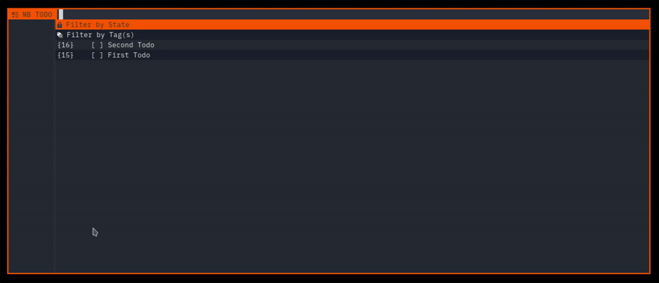

# bemenu-nb-todo

A [bemenu](https://github.com/Cloudef/bemenu) tool to manage TODOs & Tasks managed with [nb](https://github.com/xwmx/nb) knowledge base application. List, add, tag and edit your todos and related tasks from a simple and fast menu.



The preview uses my wrapper for bemenu: [bemenu-orange-wrapper](https://github.com/tkapias/bemenu-orange-wrapper).

## Dependencies

- [nb](https://github.com/xwmx/nb)
- [bemenu >= 0.6](https://github.com/Cloudef/bemenu)
- [Nerd Fonts (Symbols Only)](https://github.com/ryanoasis/nerd-fonts/releases/latest)
- Bash >= 5
- Sed
- Grep
- Awk

### Optional

- [bemenu-orange-wrapper](https://github.com/tkapias/bemenu-orange-wrapper)

## Installation

```bash
git clone --depth 0 https://github.com/tkapias/bemenu-nb-todo.git bemenu-mpdcli
cd bemenu-nb-todo
chmod +x bemenu-nb-todo.sh
```

  - If your nb config uses a non default location, export `NBRC_PATH=` in your session profile, or uncomment it in the script.

- Optional: Symlink to a directory in your user's path:

```bash
ln -s $PWD/bemenu-nb-todo.sh $HOME/.local/bin/bemenu-nb-todo
```

## Features

- List existing Todos ID & Title.
- Filter by open/closed states.
- Filter by existing tags.
- Display Todo content, including Tags, Tasks, Due Date, Description, Related links.
- Add/Delete/Do/Undo Todo.
- Add/Do/Undo Task.
- Add/Delete Tags.

## Usage

bemenu-nb-todo should work out of the box for a default nb installation.

The todos/tasks will be located in the default `home` notebook, in the `todos/` folder.

  - You can also provide 3 optional arguments:

```bash
bemenu-nb-todo [notebook_name] [todos_folder_name] [new_todo_tag_name]
```

All actions are done by intuitive selections, except those 3:

  - Add todo: in the main list, input any string that starts differently of the strings in the list.
  - Add task: in the todo content list, input a string starting with `- [ ]` or `- [x] `.
  - Edit tags: in the todo content list, input a string starting with `#` followed by a character. You can input tags separated by spaces. The existing tags in the todo will be deleted and new ones will be added.

### Integrations

- Binding exemple for bemenu-nb-todo in i3wm:

```i3wm
bindsym $mod+t exec --no-startup-id "NBRC_PATH=/home/user/.config/nb/nbrc bemenu-nb-todo home todos todo"
```

